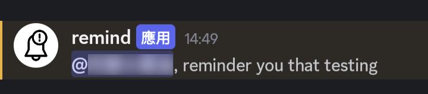

# Remind Later - Discord Bot

A simple Discord bot for remind later.

## Deployment

### Preparation

You have to register application in discord developer portal.

Here is something you will need in this bot:

-   The discord channel ID that you want to listen at
-   The discord token for bot, You can found it at "Bot" -> "Token" section

The bot MUST have following permission:

-   Message Content Intent
-   Add Reaction
-   Manage Messages
-   Read Message History
-   Send Messages

### Configuration

You should have a `config.yaml` files for this bot setup, an example is like:

```yaml
discord-token: MY-TOKEN
discord-channel: MY-CHANNEL-ID
```

This config.yaml should put in the same location of this application executable.

### Run

Ensure `config.yaml` is existed:

```bash
go run .
```

### Run as docker images

Developer can choose to run this application in docker, but require more steps:

1. Copy the content of this repoistory to linux machine
2. Run command to build docker images, like:
    ```bash
    docker build -t dark-person/remind-later-dc:latest .
    ```
3. Then create a container for this docker image. In this example, we will use docker compose for clean instruction.

    ```yaml
    services:
        remind-later-dc:
            image: dark-person/remind-later-dc:latest
            container_name: remind-later-dc
            volumes:
                - /{YOUR APPS LOCATION}/config.yaml:/config.yaml
    ```

    **Please remember to replace `{YOUR APPS LOCATION}` to your actual location**

4. Run container, e.g. `docker compose up -d`.

## How to use (User Guide)

1. mention the bot with time period and your message:
   
   In below example, time period will be "1m" (1 minute later), with message "testing".

2. Wait the bot to send your a tick reaction, imply your request is being accepted.
   

3. When the time come, bot will delete your message, and send a message that mention you:
   

### Clear all reminder sent

You can use `!clean` or `!clear` to remove all reminder message that the bot sent.

### Time Foramt support

Currently support hour `h`, minute `m` and second `s`.

Here is some example for you:

| Example | Period               |
| ------- | -------------------- |
| `1h`    | 1 Hour               |
| `2m`    | 2 Minutes            |
| `3s`    | 3 seconds            |
| `1h2m`  | 1 Hour and 2 Minutes |
| `1h3s`  | 1 hour and 3 seconds |
